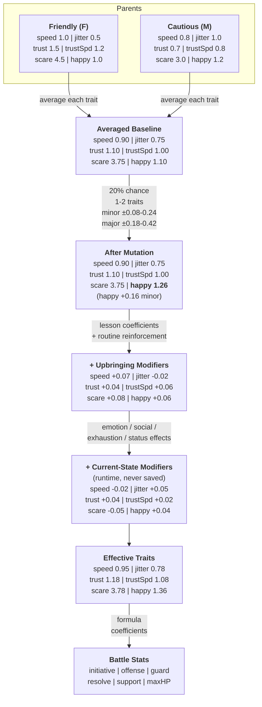
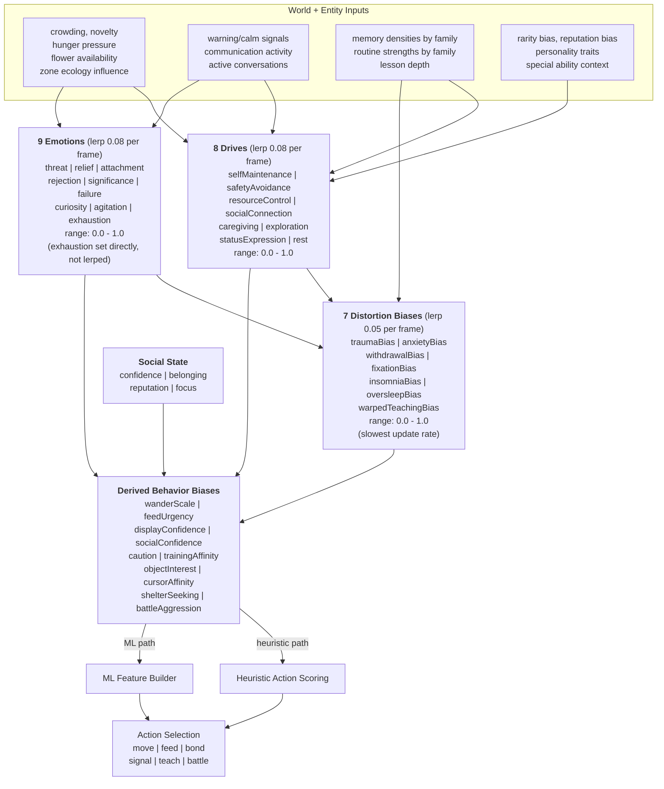
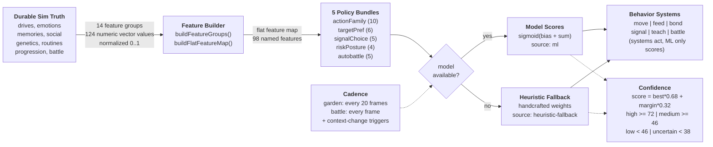
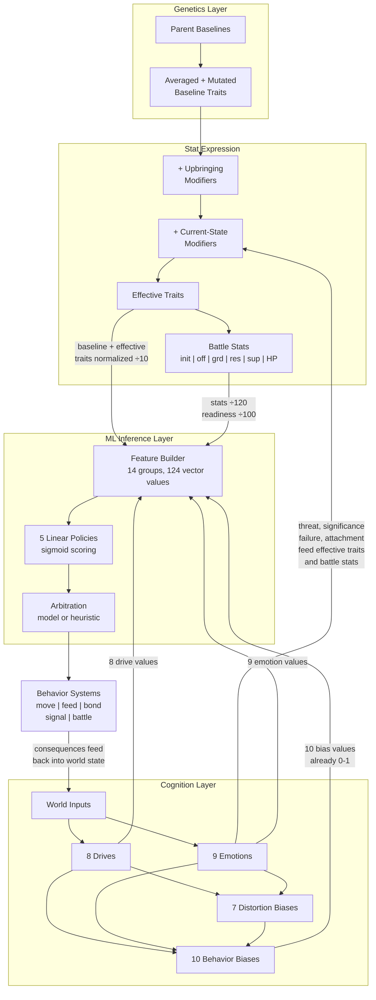

# Papilionem System Diagrams

Reference diagrams with real numeric values for the genetics, cognition, and ML
inference pipelines.

All values are taken directly from the codebase. Worked examples use plausible
runtime states to show data flowing through each pipeline with concrete numbers.

Source files:

- `systems/statProfileSystem.js` — trait expression, battle stats
- `systems/breedingSystem.js` — inheritance, mutation, archetypes
- `systems/lifeSimSystem.js` — drives, emotions, distortion, behavior biases
- `systems/mlInferenceSystem.js` — feature builder, policy scoring, arbitration
- `assets/ml/m4-garden-policy.json` — policy weights and biases
- `core/entity.js` — drive/emotion/distortion profile initialization

---

## 1. Genetics and Stat Expression

### 1.1 Expression Pipeline

This diagram traces a **Friendly (F) × Cautious (M)** cross from parent traits
through inheritance, mutation, upbringing, and live state to produce effective
traits and battle stats.



### 1.2 Upbringing Modifier Coefficients

These coefficients are from `statProfileSystem.js:275-280`.

| Lesson type | speed | jitter | trust | trustSpd | scare | happy |
| --- | --- | --- | --- | --- | --- | --- |
| Training lessons | +0.18 | — | — | +0.16 | +0.08 | — |
| Care lessons | — | -0.08 | — | — | +0.22 | +0.16 |
| Social lessons | — | — | +0.18 | — | — | +0.12 |
| Warped lessons | — | +0.16 | — | — | -0.16 | — |

| Routine family | speed | jitter | trust | trustSpd | scare | happy |
| --- | --- | --- | --- | --- | --- | --- |
| Movement | +0.12 | — | — | — | — | — |
| Resource | +0.06 | — | — | — | — | — |
| Teaching | — | — | +0.06 | +0.10 | — | — |
| Social | — | — | +0.14 | — | — | — |
| Rest | — | -0.06 | — | — | — | +0.06 |

Each modifier is: `(lessonStrengthSum * coefficient) + (routineStrength * coefficient)`

### 1.3 Current-State Modifier Coefficients

These coefficients are from `statProfileSystem.js:331-336`.

| Input | speed | jitter | trust | trustSpd | scare | happy |
| --- | --- | --- | --- | --- | --- | --- |
| agitation | -0.08 | +0.55 | — | — | -0.18 | — |
| threat | — | +0.18 | -0.08 | — | -0.46 | — |
| attachment | — | — | +0.18 | — | — | — |
| relief | — | -0.16 | +0.10 | — | +0.30 | +0.14 |
| rejection | — | — | -0.22 | — | — | — |
| significance | — | — | — | — | — | +0.16 |
| failure | — | — | — | — | — | -0.14 |
| exhaustion | -0.35 | — | — | -0.10 | — | — |
| clarity | — | — | — | +(c-0.5)*0.42 | — | — |
| confidence | — | — | — | +0.16 | — | — |
| belonging | — | — | — | — | +0.12 | — |
| move_speed_bonus | +0.90 | — | — | — | — | — |
| healing_bonus | — | — | — | — | — | +0.10 |
| wake_resistance | — | — | — | — | +0.08 | — |

Expression formula:

```
effective[trait] = clamp(baseline[trait] + upbringing[trait] + currentState[trait])

clamp floor: 0.05 for most traits, 0.50 for scareThreshold
```

### 1.4 Battle Stat Derivation — Worked Example

Using the offspring from section 1.1 with effective traits and assumed live state.

**Inputs:**

```
effective traits
  speed       0.95      jitteriness   0.78
  trustProp   1.18      trustSpeed    1.08
  scareThr    3.78      happyBonus    1.36

live state
  threat      0.20      significance  0.40
  failure     0.10      attachment    0.50
  confidence  0.60      belonging     0.70
  exhaustion  0.15
```

**Battle stat formulas** (from `statProfileSystem.js:381-430`, all clamped 10-120):

| Stat | Formula | Substituted | Raw | Result |
| --- | --- | --- | --- | --- |
| Initiative | `spd*16 + tSpd*11 + (2.4-jit)*7 + conf*12 - exh*22` | 0.95\*16 + 1.08\*11 + 1.62\*7 + 0.60\*12 - 0.15\*22 | 15.2 + 11.88 + 11.34 + 7.2 - 3.3 | **42** |
| Offense | `spd*15 + hap*10 + jit*4 + sig*10` | 0.95\*15 + 1.36\*10 + 0.78\*4 + 0.40\*10 | 14.25 + 13.6 + 3.12 + 4.0 | **35** |
| Guard | `scare*12 + tSpd*6 + (1-thr)*10 + (1-exh)*8` | 3.78\*12 + 1.08\*6 + 0.80\*10 + 0.85\*8 | 45.36 + 6.48 + 8.0 + 6.8 | **67** |
| Resolve | `scare*10 + hap*9 + bel*12 + (1-fail)*8` | 3.78\*10 + 1.36\*9 + 0.70\*12 + 0.90\*8 | 37.8 + 12.24 + 8.4 + 7.2 | **66** |
| Support | `trust*12 + hap*8 + conf*10 + att*12` | 1.18\*12 + 1.36\*8 + 0.60\*10 + 0.50\*12 | 14.16 + 10.88 + 6.0 + 6.0 | **37** |
| **Max HP** | `70 + guard*0.8 + resolve*0.35` | 70 + 67\*0.8 + 66\*0.35 | 70 + 53.6 + 23.1 | **147** |

**Result summary:**

```
╔═══════════════════════════════════════════╗
║ Initiative  42    Offense  35             ║
║ Guard       67    Resolve  66             ║
║ Support     37    Max HP  147             ║
╚═══════════════════════════════════════════╝
```

### 1.5 Mutation Detail

From `breedingSystem.js`:

```
mutation chance:    20% per offspring
major sub-chance:   6% (if mutation triggers)

mutated traits:     1-2 per offspring
                    66% chance of 1 trait
                    34% chance of 2 traits

minor delta range:  ±0.08 to ±0.24
major delta range:  ±0.18 to ±0.42

direction:          50% positive, 50% negative
applied:            post-average, modifies baseline directly
abilities:          never mutate
```

### 1.6 Inheritance Rules

```
trait inheritance:     average of both parents' baselines per trait
ability inheritance:   random 50/50 from either parent (never mutates)
wing inheritance:      each of 4 wings independently from either parent
color inheritance:     averaged RGB channels from both parents
sex:                   random 50/50
```

---

## 2. Cognition / Life-Sim System

### 2.1 Cognition State Flow



### 2.2 Drive Computation Detail

Each drive target is computed from world/entity inputs, then lerped toward at
**0.08 per frame**: `newDrive = current + (target - current) * 0.08`

From `lifeSimSystem.js:1413-1422`:

```
selfMaintenance   = 0.14 + hunger*0.45 + threat*0.18 + rejection*0.1
                    + outcomeMemory*0.06 + restRoutine*0.05 + zone.selfMaint

safetyAvoidance   = 0.12 + crowding*0.24 + threat*0.56 + warningPressure
                    + dangerMemory*0.18 + vigilanceRoutine*0.18
                    + anxietyBias*0.18 + traumaBias*0.14 + zone.safety

resourceControl   = 0.12 + hunger*0.58 + feedFocus + (1-flowers)*0.12
                    + resourceRoutine*0.18 + outcomeMemory*0.06 + zone.resource

socialConnection  = 0.10 + (1-attachment)*0.22 + received*0.03 + convBonus
                    + trainingStr*0.15 + socialRoutine*0.16
                    + socialMemory*0.08 + interactionMemory*0.08
                    + lessonDepth*0.08 + zone.social

caregiving        = 0.05 + careState + admiration*0.1 + careRoutine*0.18
                    + careMemory*0.2 + zone.caregiving

exploration       = 0.10 + novelty*0.34 + happiness*0.2 - crowding*0.24
                    - careState*0.3 - (sleeping ? 0.4 : 0)
                    + movementRoutine*0.12 + placeMemory*0.06
                    + routineMemory*0.05 + zone.exploration

statusExpression  = 0.10 + rarityBias + reputationBias + admiration*0.22
                    + displayState + emitted*0.03 + trainingStr*0.08
                    + lessonDepth*0.08 + zone.status

rest              = 0.08 + exhaustion*0.74 + (sleeping ? 0.18 : 0)
                    + restRoutine*0.14 + oversleepBias*0.08
                    - insomniaBias*0.06 + zone.rest
```

### 2.3 Distortion Computation Detail

Each distortion bias target is computed, then lerped toward at **0.05 per frame**
(slowest update in the system). From `lifeSimSystem.js:1453-1466`:

```
traumaBias          = dangerMemory*0.52 + threat*0.24 + cursorFear*0.18
anxietyBias         = threat*0.70 + agitation*0.22 + dangerMemory*0.12
withdrawalBias      = rejection*0.80 + crowding*0.08 + lessonReinf*0.04
fixationBias        = max(status, care, resource*0.82)*0.72 + lessonDepth*0.08
insomniaBias        = agitation*0.44 + threat*0.18 + warningPressure*0.3
                      - relief*0.14
oversleepBias       = exhaustion*0.54 + restDrive*0.24 - agitation*0.08
warpedTeachingBias  = warpedSignals*0.10 + lessonDepth*0.12
                      + rejection*0.12 + (training ? agitation*0.08 : 0)
```

### 2.4 Behavior Bias Derivation — Worked Example

From `lifeSimSystem.js:1022-1067`.

**Inputs:**

```
drives
  exploration    0.60    resourceControl  0.30
  rest           0.20    safetyAvoidance  0.25
  statusExpr     0.40    socialConnection 0.55
  selfMaint      0.30    caregiving       0.15

emotions
  threat         0.20    significance     0.40
  failure        0.10    rejection        0.15
  curiosity      0.50    agitation        0.10

social
  confidence     0.60    belonging        0.70

distortion
  withdrawalBias 0.10    anxietyBias      0.15
  fixationBias   0.05    traumaBias       0.10
  insomniaBias   0.08
```

**Bias formulas and results:**

| Bias | Formula terms | Computation | Result |
| --- | --- | --- | --- |
| wanderScale | `clamp01(0.5 + explore*0.75 + conf*0.2 - rest*0.3 - withdraw*0.12) + 0.1` | 0.5 + 0.45 + 0.12 - 0.06 - 0.012 = 0.998, +0.1 | **1.0** |
| feedUrgency | `clamp01(resource*0.72 + failure*0.18 + selfMaint*0.1)` | 0.216 + 0.018 + 0.030 | **0.26** |
| displayConf | `clamp01(status*0.46 + signif*0.34 + conf*0.28 + fix*0.08 - threat*0.16 - withdraw*0.12)` | 0.184 + 0.136 + 0.168 + 0.004 - 0.032 - 0.012 | **0.45** |
| socialConf | `clamp01(social*0.34 + belong*0.34 + conf*0.22 - reject*0.18 - withdraw*0.2)` | 0.187 + 0.238 + 0.132 - 0.027 - 0.020 | **0.51** |
| caution | `clamp01(safety*0.44 + threat*0.34 + anxiety*0.22 + trauma*0.14 + withdraw*0.08)` | 0.110 + 0.068 + 0.033 + 0.014 + 0.008 | **0.23** |
| trainingAff | `clamp01(trainingAffinity + boost)` | (from options/routines) | context |
| objectInterest | `clamp01(base + fixation*0.12)` | base + 0.006 | context |
| cursorAffinity | `clamp01(base - trauma*0.12 - anxiety*0.05)` | base - 0.012 - 0.008 | context |
| shelterSeeking | `clamp01(base + trauma*0.14 + insomnia*0.04)` | base + 0.014 + 0.003 | context |
| battleAggr | `clamp01(base + fixation*0.08 - withdraw*0.08)` | base + 0.004 - 0.008 | context |

Note: `trainingAffinity`, `objectInterest`, `cursorAffinity`, `shelterSeeking`,
and `battleAggression` all consume a base value passed from `updateButterfly`
options, then shift it by distortion. The distortion shifts shown above are the
additive modifications applied on top of that base.

### 2.5 Interpretation / Clarity

From `lifeSimSystem.js:1450-1451`, lerped at **0.06 per frame**:

```
clarity target = 0.56 + attachment*0.18 + relief*0.12
                 - agitation*0.16 - crowding*0.08

clarity = lerp(currentClarity, target, 0.06)
```

### 2.6 Update Speed Summary

```
╔═══════════════════════════════════════════════════╗
║ Layer             │ Lerp Factor │ Response Speed  ║
╠═══════════════════╪═════════════╪═════════════════╣
║ Drives            │ 0.08        │ fast            ║
║ Emotions          │ 0.08        │ fast            ║
║ (exhaustion)      │ direct set  │ instant         ║
║ Interpretation    │ 0.06        │ medium          ║
║ Distortion biases │ 0.05        │ slow            ║
║ Zone affinities   │ 0.08-0.18   │ fast-very fast  ║
╚═══════════════════════════════════════════════════╝

lerp formula: newValue = current + (target - current) * factor
all values clamped to 0.0 - 1.0
```

---

## 3. ML Inference Layer

Current live status:

- shipped runtime: local static linear-policy artifact (`m4-garden-policy.json`)
- current source path: `ml` when the artifact is loaded, `heuristic-fallback` if it is unavailable
- later ONNX/model-bundle rollout is still future work on `c4`-`c7`

### 3.1 Inference Pipeline



### 3.2 Linear Policy Scoring — How It Works

Each policy is a set of labels. For each label:

```
rawScore = bias[label] + Σ (feature[name] * weight[name])
score    = sigmoid(rawScore) = 1 / (1 + e^(-rawScore))
```

The label with the highest sigmoid score wins.

### 3.3 riskPosture Policy — Worked Example

Using **real weights from `assets/ml/m4-garden-policy.json`**.

**Assumed feature values** (from the butterfly in sections 1-2):

```
behavior.cursorAffinity     0.40    player.cursorTrust      0.60
player.cursorFear           0.10    behavior.socialConfidence 0.51
interpretation.clarity      0.80    emotions.relief          0.50
emotions.threat             0.20    behavior.caution         0.23
world.novelty               0.50    object.affordanceIsObserve 0
emotions.rejection          0.15    interpretation.anxietyBias 0.15
world.crowding              0.30
```

**Score computation for each label:**

**approach** (bias = -0.56)

| Feature | Value | Weight | Product |
| --- | --- | --- | --- |
| behavior.cursorAffinity | 0.40 | 1.10 | 0.440 |
| player.cursorTrust | 0.60 | 0.82 | 0.492 |
| behavior.socialConfidence | 0.51 | 0.24 | 0.122 |
| interpretation.clarity | 0.80 | 0.20 | 0.160 |
| emotions.relief | 0.50 | 0.18 | 0.090 |
| player.cursorFear | 0.10 | -0.44 | -0.044 |
| emotions.threat | 0.20 | -0.34 | -0.068 |
| | | bias | -0.560 |
| | | **raw sum** | **0.632** |
| | | **sigmoid** | **0.653** |

**observe** (bias = -0.28)

| Feature | Value | Weight | Product |
| --- | --- | --- | --- |
| world.novelty | 0.50 | 0.34 | 0.170 |
| object.affordanceIsObserve | 0 | 0.28 | 0 |
| interpretation.clarity | 0.80 | 0.22 | 0.176 |
| behavior.caution | 0.23 | 0.12 | 0.028 |
| player.cursorTrust | 0.60 | 0.08 | 0.048 |
| emotions.threat | 0.20 | -0.08 | -0.016 |
| | | bias | -0.280 |
| | | **raw sum** | **0.126** |
| | | **sigmoid** | **0.531** |

**avoid** (bias = -0.54)

| Feature | Value | Weight | Product |
| --- | --- | --- | --- |
| behavior.caution | 0.23 | 0.96 | 0.221 |
| player.cursorFear | 0.10 | 0.64 | 0.064 |
| emotions.threat | 0.20 | 0.48 | 0.096 |
| emotions.rejection | 0.15 | 0.24 | 0.036 |
| behavior.socialConfidence | 0.51 | -0.18 | -0.092 |
| player.cursorTrust | 0.60 | -0.16 | -0.096 |
| | | bias | -0.540 |
| | | **raw sum** | **-0.311** |
| | | **sigmoid** | **0.423** |

**flee** (bias = -0.84)

| Feature | Value | Weight | Product |
| --- | --- | --- | --- |
| emotions.threat | 0.20 | 1.16 | 0.232 |
| player.cursorFear | 0.10 | 0.92 | 0.092 |
| behavior.caution | 0.23 | 0.52 | 0.120 |
| interpretation.anxietyBias | 0.15 | 0.32 | 0.048 |
| world.crowding | 0.30 | 0.12 | 0.036 |
| player.cursorTrust | 0.60 | -0.20 | -0.120 |
| | | bias | -0.840 |
| | | **raw sum** | **-0.432** |
| | | **sigmoid** | **0.394** |

**Result:**

```
╔════════════════════════════════════════════════════╗
║ Label       │ Raw Sum │ Sigmoid │ Rank            ║
╠═════════════╪═════════╪═════════╪═════════════════╣
║ approach    │  0.632  │  0.653  │ 1st (chosen)    ║
║ observe     │  0.126  │  0.531  │ 2nd             ║
║ avoid       │ -0.311  │  0.423  │ 3rd             ║
║ flee        │ -0.432  │  0.394  │ 4th             ║
╚════════════════════════════════════════════════════╝

confidence calculation
  best = 0.653, second = 0.531
  margin = 0.653 - 0.531 = 0.122
  normalized = 0.653 * 0.68 + 0.122 * 0.32 = 0.483
  score = round(0.483 * 100) = 48
  band = medium (>= 46)
  uncertain = false (>= 38)

decision: approach, confidence 48 (medium)
```

This butterfly approaches with medium confidence. The high `cursorTrust` (0.60)
and `cursorAffinity` (0.40) strongly drive `approach`, while the low
`cursorFear` (0.10) and `threat` (0.20) make `flee` and `avoid` unlikely.

### 3.4 actionFamily Policy — Weight Map

Real biases and selected weights from `assets/ml/m4-garden-policy.json`.
Only the strongest positive and negative weights are shown per label.

| Label | Bias | Strongest positive weights | Strongest negative weight |
| --- | --- | --- | --- |
| wander | -0.15 | wanderScale 1.15, exploration 0.72, curiosity 0.46 | feedUrgency -0.42 |
| feed | -0.35 | feedUrgency 1.82, flowerAvail 0.72, resource 0.48 | threat -0.32 |
| socialize | -0.42 | socialConf 1.05, socialConn 0.62, belonging 0.42 | cursorFear -0.18 |
| signal | -0.58 | displayConf 0.86, commActivity 0.38, reputation 0.24 | — |
| teach | -0.72 | trainingAff 1.12, reputation 0.32, zoneIsTraining 0.26 | — |
| court | -0.78 | caregiving 0.62, attachment 0.58, lineageValue 0.34 | — |
| rest | -0.40 | restDrive 1.18, exhaustion 0.86 | — |
| avoid | -0.52 | caution 0.92, threat 0.98, cursorFear 0.56 | clarity -0.18 |
| buildOrUseObject | -0.62 | objectInterest 0.98, shelterSeeking 0.62, blockFam 0.34 | — |
| battlePosture | -0.90 | battleAggr 0.96, enemyThreat 0.28, targetPriority 0.22 | — |

All biases are negative, meaning every action needs positive feature evidence to
activate. Rare behaviors (court, teach, battle) have the most negative biases,
requiring strong specific feature support to win.

### 3.5 Feature Group Summary

From `mlInferenceSystem.js`, `buildFeatureGroups()`:

| Group | Fields | Normalization | Source owner |
| --- | --- | --- | --- |
| identity | 6 | categorical index / domain length | entity |
| genetics | 13 | traits ÷ 10, booleans 0/1 | statProfileSystem |
| drives | 8 | already 0-1 | lifeSimSystem |
| emotions | 9 | already 0-1 | lifeSimSystem |
| social | 6 | values direct, counts ÷ 100 | lifeSimSystem |
| interpretation | 8 | values direct, warpedSignals ÷ 8 | lifeSimSystem |
| memoryRoutine | 9 | counts ÷ 10 or ÷ 12 | lifeSimSystem |
| playerInteraction | 5 | values direct, counts ÷ 12 | lifeSimSystem |
| objectAwareness | 8 | categorical + familiarity 0-1 | lifeSimSystem |
| spatial | 6 | categorical + density 0-1 | structureSystem / physicsSystem |
| progression | 5 | values 0-1 | progressionManager |
| world | 8 | counts ÷ 6 or ÷ 8, crowding 0-1 | zoneSystem / gameCore |
| autobattle | 10 | readiness ÷ 100, stats ÷ 120 | battleSystem |
| behavior | 13 | biases 0-1, categorical | lifeSimSystem / behaviorSystem |

**Live runtime total: 14 groups, 98 flat named features, 124 numeric vector elements**

All missing values encode as explicit 0 or default, never NaN.

---

## Appendix A: Archetype Baseline Traits

From `breedingSystem.js`, `BUTTERFLY_PERSONALITIES`:

| Archetype | Rarity | speed | jitter | trust | trustSpd | scare | happy | Ability |
| --- | --- | --- | --- | --- | --- | --- | --- | --- |
| Friendly | Common | 1.0 | 0.5 | 1.5 | 1.2 | 4.5 | 1.0 | welcome |
| Cautious | Uncommon | 0.8 | 1.0 | 0.7 | 0.8 | 3.0 | 1.2 | sparkle |
| Energetic | Uncommon | 1.5 | 1.8 | 1.0 | 1.5 | 3.5 | 0.8 | speedzone |
| Skittish | Rare | 1.3 | 2.0 | 0.5 | 0.5 | 2.0 | 1.5 | cascade |
| Wise | Rare | 1.0 | 0.3 | 0.8 | 1.0 | 5.0 | 2.0 | teacher |
| Mystic | Epic | 1.0 | 0.8 | 0.6 | 0.7 | 3.5 | 2.5 | shimmer |
| Golden | Legendary | 2.5 | 3.0 | 0.1 | 0.067 | 999 | 5.0 | golden |

Spawn rates: Friendly 40%, Cautious 15%, Energetic 15%, Skittish 10%, Wise 10%,
Mystic 10%, Golden special unlock only.

## Appendix B: Full System Integration

How the three systems connect end-to-end:



Key integration rules:

```
genetics owns:       baseline trait truth (never mutated by ML or cognition)
cognition owns:      drives, emotions, memories, distortion (never written by ML)
ML reads:            features built from all owner systems
ML writes:           preference scores only (never mutates owner truth)
battle stats read:   effective traits + live emotional/social state
behavior systems:    execute actions chosen by ML or heuristic scoring
```
