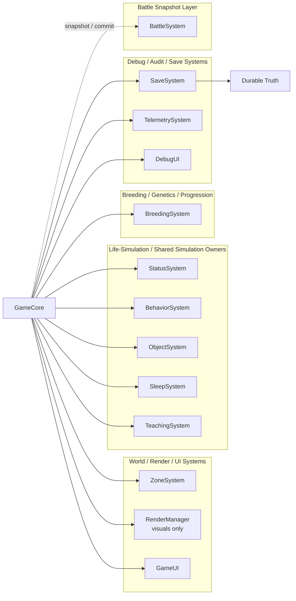
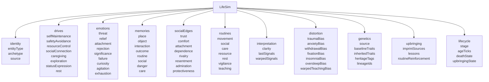
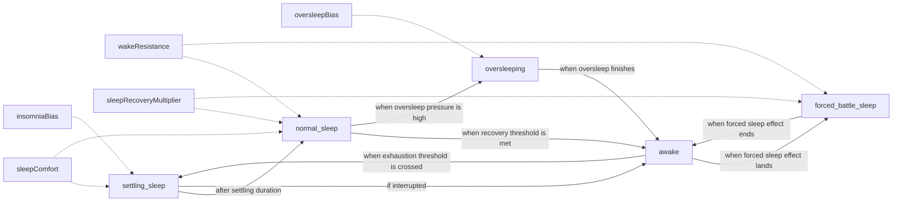
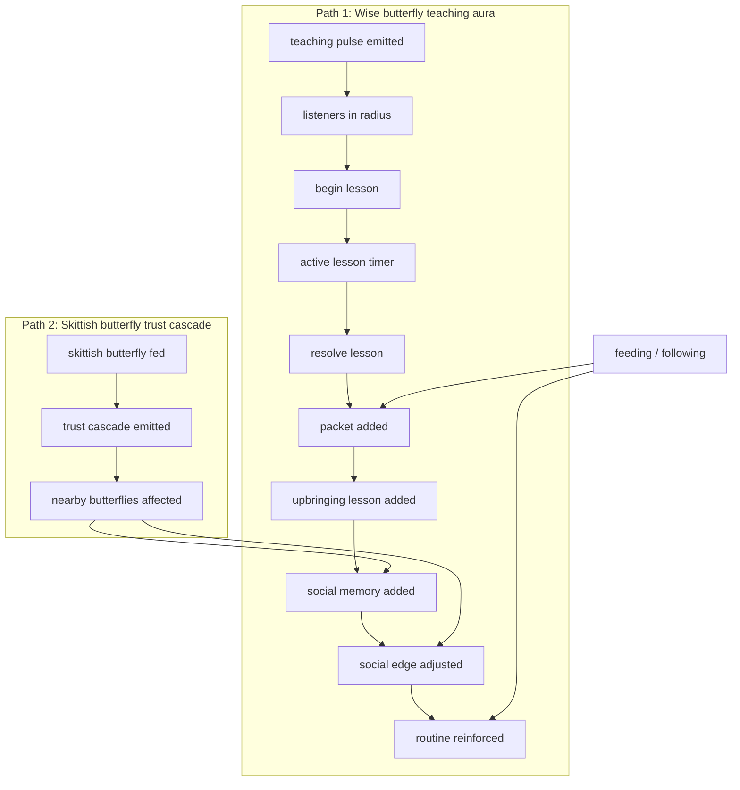
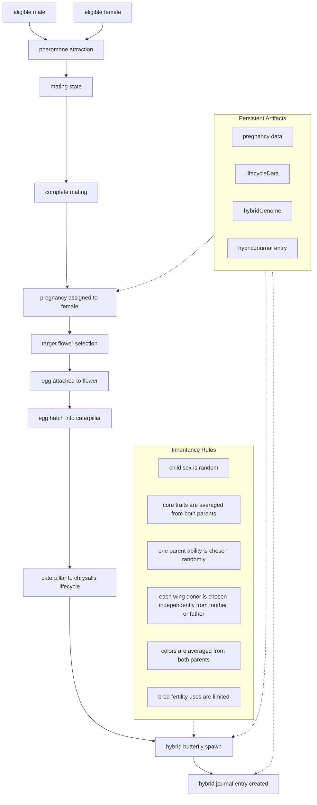
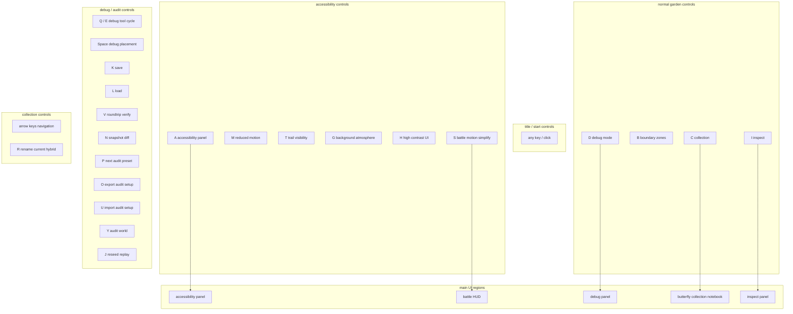
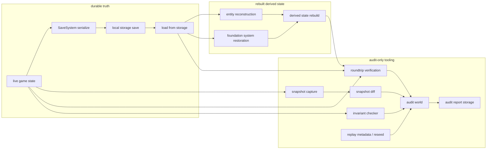
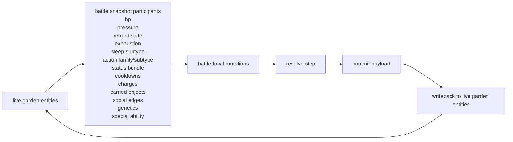

# Papilionem Guidebook Developer Track

Use the canonical developer reference here:

- [../PAPILIONEM-GUIDEBOOK.md](../PAPILIONEM-GUIDEBOOK.md)

```text
╔════════════════════ Developer Track ════════════════════╗
║ best for                                                  ║
║  ├─ system design review                                  ║
║  ├─ implementation lookup                                  ║
║  ├─ tuning and balancing                                    ║
║  └─ breeding / neuro-social / lifecycle reference           ║
╚══════════════════════════════════════════════════════════════╝
```

Recommended companion docs:

- [../GEMINI-DIAGRAM-PROMPTS.md](../GEMINI-DIAGRAM-PROMPTS.md)
- [../../core/config.js](../../core/config.js)

## Systems Architecture



This is the current best visual map of the major owner boundaries and the separation between:

- world/render/UI
- shared life-simulation systems
- breeding/progression
- debug/save systems
- the isolated battle snapshot layer

## Life-Simulation Container



This version is usable and much closer to the implemented structure than the first pass. It is best treated as a reference plate for the major compartments of the butterfly life-simulation state.

## Sleep State Machine



This is the current visual summary of the sleep-state transitions and the side inputs that influence sleep and wake behavior.

## Teaching / Trust Flow



This is especially useful when reasoning about how memories, social edges, and routine reinforcement connect.

## Genetics / Breeding Lifecycle



This shows the implemented breeding flow and the side panel inheritance rules in a compact visual form.

## Controls / UI Map



This controlled diagram is the exact version of the controls/UI map. The Gemini render is still kept as a supplemental player-facing plate because it looks friendlier, but this Mermaid version is the authoritative structure.

## Pending Diagrams

## Save / Load / Audit Workflow



This Mermaid version is intentionally stricter than the Gemini attempts. It preserves the exact workflow nodes we wanted without inventing extra validator/rebuilder/deserializer layers.

## Battle Snapshot Separation



This controlled version keeps the architecture exact:

- live garden truth is separate from battle-local mutation
- the battle snapshot is the container for all participant data
- only the commit payload writes anything back to the live garden

For the current generation status, see:

- [DIAGRAM-AUDIT-STATUS.md](./DIAGRAM-AUDIT-STATUS.md)
