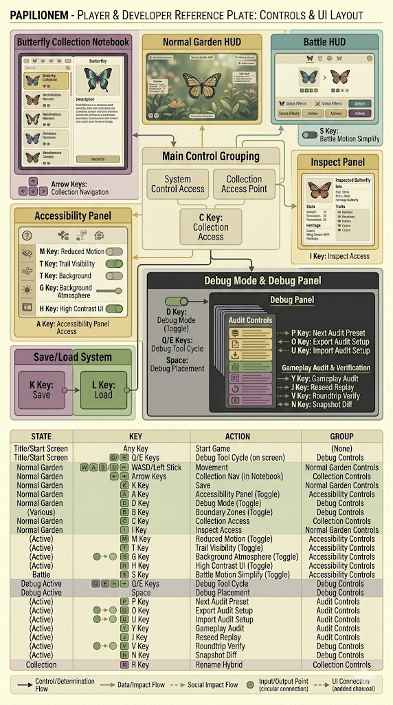
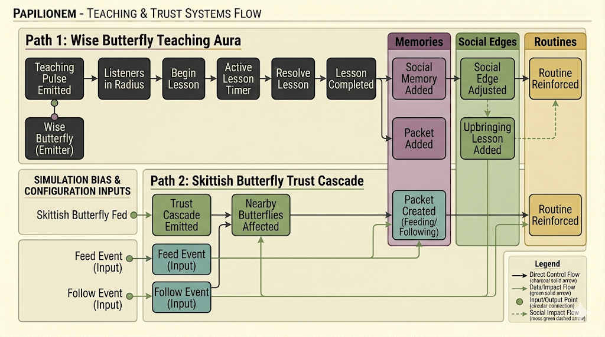
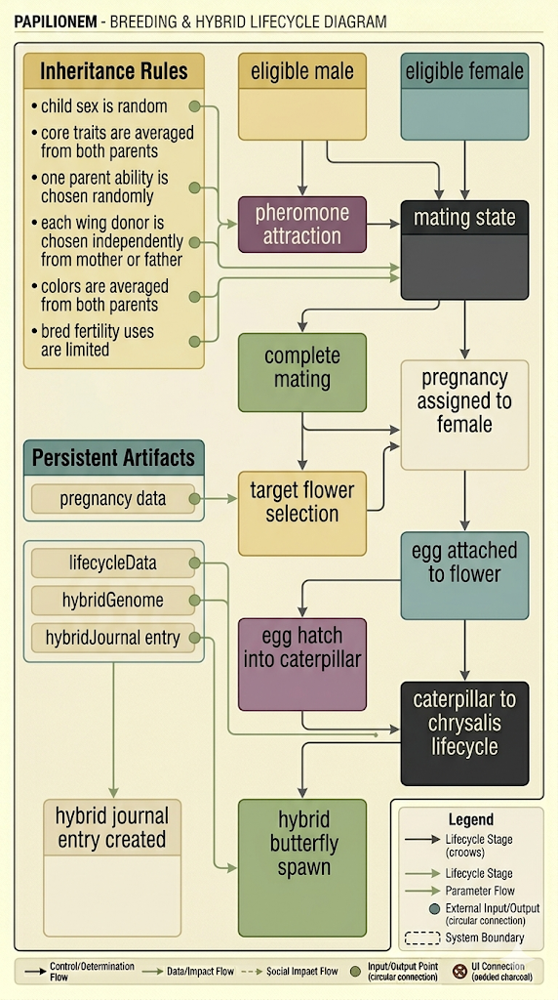

# Papilionem Guidebook Player Track

Use the canonical player guide here:

- [../PAPILIONEM-PLAYER-GUIDE.md](../PAPILIONEM-PLAYER-GUIDE.md)

```text
╔════════════════════ Player Track ════════════════════╗
║ best for                                               ║
║  ├─ players                                            ║
║  ├─ testers                                             ║
║  └─ collaborators who want the "how it plays" view     ║
╚════════════════════════════════════════════════════════╝
```

Recommended companion docs:

- [../../PLAYTEST.md](../../PLAYTEST.md)
- [../../PLAYTEST-FEEDBACK.md](../../PLAYTEST-FEEDBACK.md)

## Visual Guide

### Controls And UI



This is the best current quick-reference sheet for:

- normal controls
- accessibility controls
- debug and audit shortcuts
- collection controls
- the rough UI surface layout

### Teaching, Trust, And Social Reinforcement



This is the clearest visual summary of how:

- wise butterflies teach
- skittish butterflies emit trust cascades
- memory, social edges, and routines get reinforced over time

### Breeding And Hybrid Lifecycle



Use this to quickly understand the broad lifecycle from:

- attraction
- mating
- pregnancy
- egg attachment
- caterpillar / chrysalis progression
- hybrid butterfly emergence

## Visual Notes

```text
╔════════════════════ Current Player-Facing Visual Set ════════════════════╗
║ controls / UI map                    │ strong                            ║
║ teaching / trust flow                │ strong                            ║
║ breeding lifecycle                   │ strong after revision             ║
║ sleep state machine                  │ available in developer track      ║
╚═══════════════════════════════════════════════════════════════════════════╝
```
